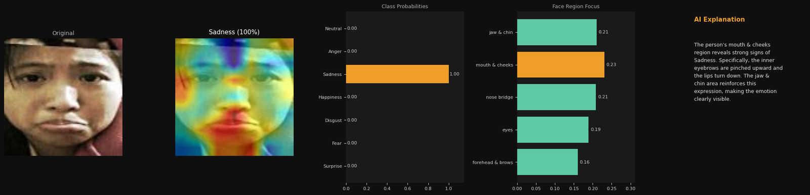
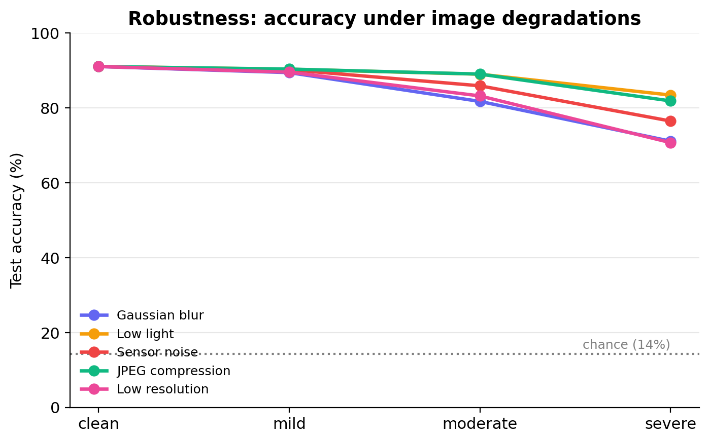
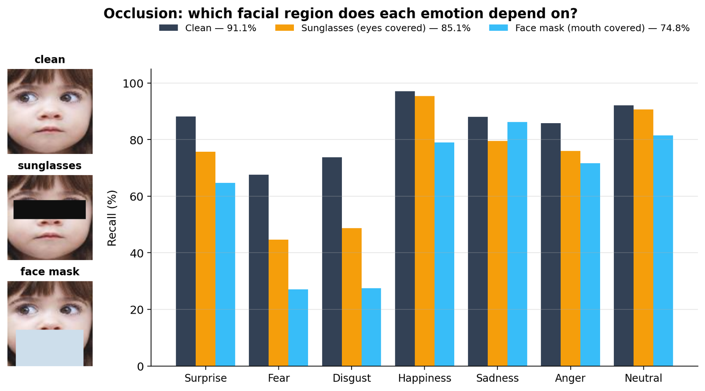
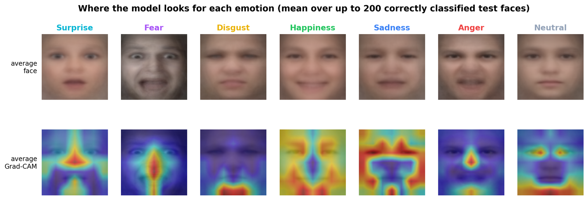
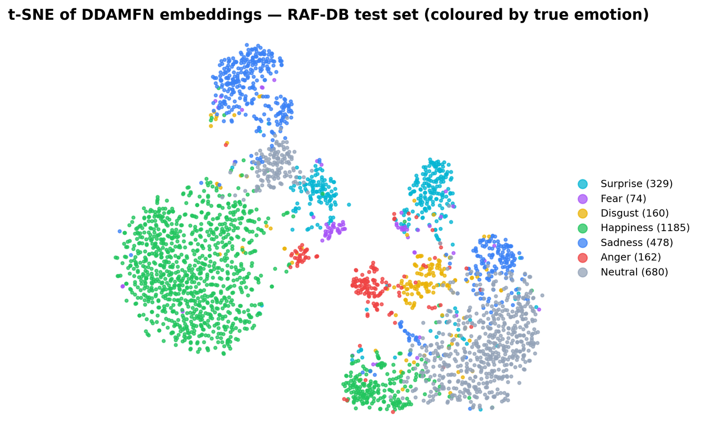
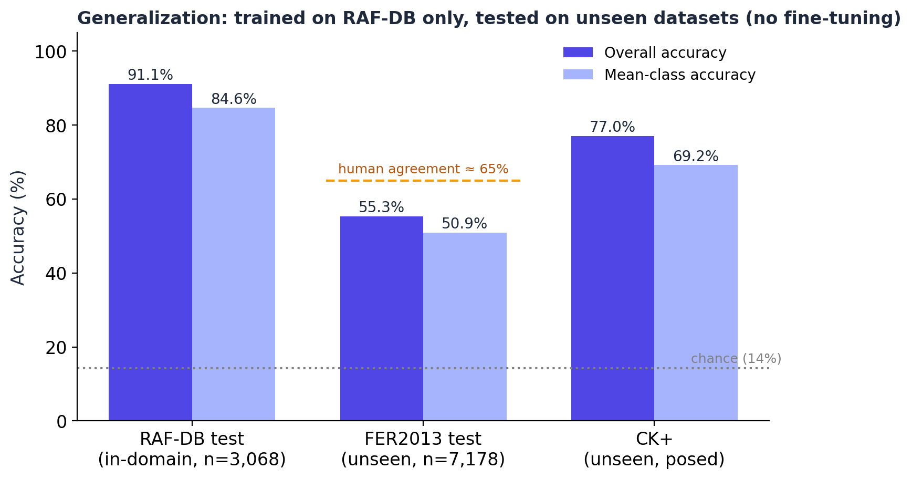
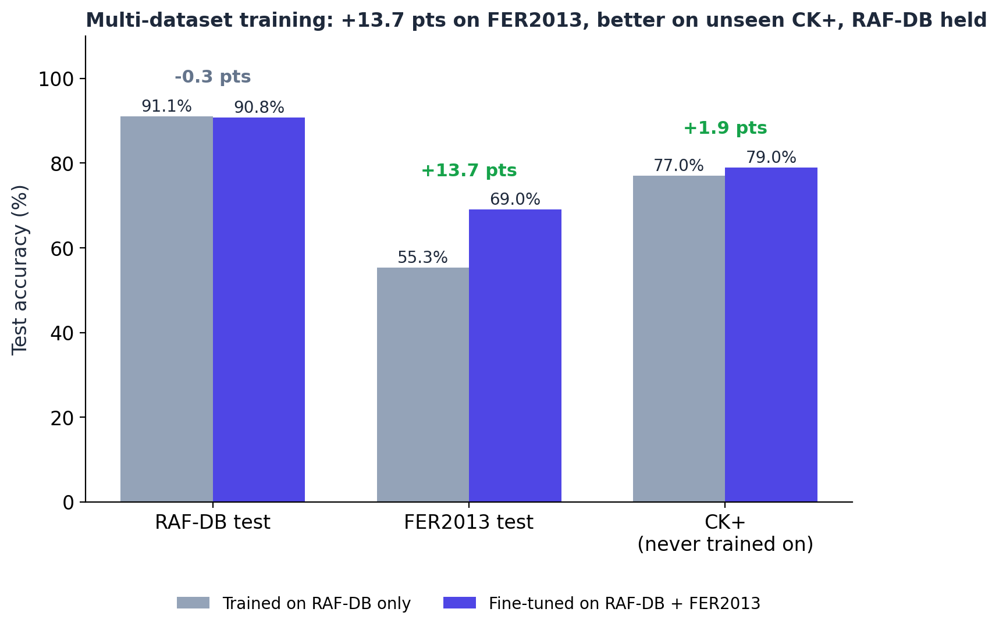
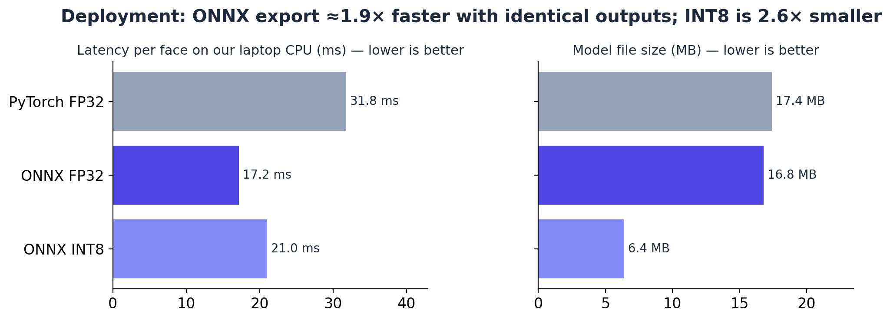

# Visual Sentiment Analysis — Facial Emotion Recognition (RAF-DB)

Facial emotion recognition on **RAF-DB**, mapped onto **3-, 5-, and 7-level sentiment scales**. A fine-tuned
**DDAMFN** model reaches **91.07%** on the official test set (close to published state of the art) with only
**4.19 M parameters**. A soft-vote ensemble with ConvNeXt-V2 reaches **91.59%**. The model is stress-tested for
robustness, occlusion and calibration, explained with Grad-CAM, and deployed as a live web demo.

**▶ Live demo:** [huggingface.co/spaces/Hr1dye5h/facial-emotion-recognition](https://huggingface.co/spaces/Hr1dye5h/facial-emotion-recognition)
(Grad-CAM explanations · real-time webcam · group-photo mood meter · specialist / generalist model switch)

---

## Overview
- **Task:** 7-class facial emotion recognition — *Surprise, Fear, Disgust, Happiness, Sadness, Anger, Neutral*.
- **Sentiment scales:** 5-level, and 3-level valence (positive / neutral / negative).
- **Framework:** PyTorch. **Trained on:** Kaggle (T4 / P100 GPU).

## Dataset — RAF-DB (Real-world Affective Faces Database)
- **RAF-DB basic** subset: **12,271 training** / **3,068 test** images across 7 basic emotions.
- Aligned RGB faces. The dataset is **imbalanced**: Happiness dominates while Fear and Disgust are rare.
  That is why mean-class (balanced) accuracy is reported alongside overall accuracy.

## Results

### Single model — DDAMFN
| Metric | Score |
| --- | --- |
| **7-class overall accuracy** | **91.07%** |
| 7-class mean-class (balanced) | 84.64% |
| 5-scale accuracy | 92.11% |
| 3-scale (valence) accuracy | 92.89% |
| Parameters / compute | 4.19 M / 1.08 GFLOPs |
| CPU latency (batch 1, laptop) | ~30 ms per face (PyTorch) · ~17 ms (ONNX) |

Per-class (test set):

| Emotion | Precision | Recall | F1 | Support |
| --- | --- | --- | --- | --- |
| Surprise | 0.895 | 0.881 | 0.888 | 329 |
| Fear | 0.769 | 0.676 | 0.719 | 74 |
| Disgust | 0.792 | 0.737 | 0.764 | 160 |
| Happiness | 0.965 | 0.970 | 0.968 | 1185 |
| Sadness | 0.894 | 0.881 | 0.887 | 478 |
| Anger | 0.914 | 0.858 | 0.885 | 162 |
| Neutral | 0.875 | 0.921 | 0.898 | 680 |

### Ensemble (DDAMFN + ConvNeXt-V2) — ablation on the test set

| Model | Overall | Mean-class |
| --- | --- | --- |
| DDAMFN | 91.07% | 84.64% |
| ConvNeXt-V2 | 87.29% | 78.10% |
| **Soft-vote average** | 91.59% | **84.95%** |
| Stacking (Logistic Regression) | **91.62%** | 83.69% |

**Finding:** the simple soft-vote average is the best overall model. It matches the trained stacker on overall
accuracy (a 0.03-point gap is about one image) and is better on mean-class accuracy. The stacker got its tiny
overall gain by giving up the rare *Fear* class (recall 0.68 → 0.55). Ensemble sentiment scales:
3-scale 93.61%, 5-scale 92.76%.

### State-of-the-art context (RAF-DB, 7-class overall accuracy)
| Method | Overall acc | Params | Year |
| --- | --- | --- | --- |
| Ig3D | 94.0% | — | 2024 |
| POSTER++ | 92.21% | 43.7 M | 2023 |
| **This project (soft-vote ensemble)** | **91.59%** | 32.8 M | — |
| DDAMFN (paper) | 91.35% | 4.1 M | 2023 |
| **This project (DDAMFN, single model)** | **91.07%** | **4.19 M** | — |

The single model is within about 1 point of POSTER++ with roughly **10× fewer parameters** and **8× less compute**.

## Model analysis (`facial-emotion-analysis.ipynb`)
The trained model is tested beyond one accuracy number. No retraining is done, and the clean result reproduces 91.07% exactly.

**Robustness to real-world degradations.** Accuracy stays within ~2 points of clean under moderate low light and
JPEG compression. Heavy blur and very low resolution (20 px) are the main failure modes (~71%).

| Degradation | Mild | Moderate | Severe |
| --- | --- | --- | --- |
| Gaussian blur (σ = 1 / 2 / 3) | 89.44% | 81.75% | 71.12% |
| Low light (50% / 30% / 15%) | 90.35% | 89.02% | 83.44% |
| Sensor noise (σ = 10 / 25 / 45) | 90.22% | 85.92% | 76.50% |
| JPEG (q = 30 / 15 / 5) | 90.38% | 89.05% | 81.88% |
| Low resolution (56 / 32 / 20 px) | 89.57% | 83.21% | 70.73% |

**Occlusion — what does each emotion need to see?** A face mask costs far more than sunglasses
(74.8% vs 85.1% overall). *Happiness* depends on the mouth (recall 97% → 79% with a mask, 95% with sunglasses).
*Sadness* depends on the eyes and brows (88% → 80% with sunglasses, 86% with a mask). *Fear* and *Disgust*
need the whole face and collapse under either occlusion.

**Where the model looks.** Average Grad-CAM over correctly classified test faces. Each emotion uses different
facial evidence, for example the mouth for Disgust and the eyes/brows region for Sadness.

**Calibration.** The raw model is slightly over-confident (ECE 3.80%). One temperature (T = 1.55), fitted on the
*validation* split, brings test ECE down to **1.40%** without changing accuracy. The confidence scores shown in the
demo can therefore be trusted.

**Embedding space.** t-SNE of the 512-d features shows clean clusters for Happiness, Sadness, Surprise and Anger.
Neutral sits in the middle, which matches the most common confusions (Sadness ↔ Neutral, Happiness → Neutral).

**Test-time augmentation.** Horizontal-flip averaging adds only +0.03 points, so it is not used.

## Generalization — datasets the model has never seen (`facial-emotion-generalization.ipynb`)
The RAF-DB-trained model is evaluated **without any retraining** on two other benchmarks:

| Test set | Images | Overall | Mean-class | Notes |
| --- | --- | --- | --- | --- |
| RAF-DB (in-domain) | 3,068 | 91.07% | 84.64% | real-world colour faces |
| **FER2013** test | 7,178 | **55.29%** | 50.89% | 48×48 grayscale web faces; human agreement ≈ 65% |
| **CK+** | 927 | **77.02%** | 69.16% | lab-posed expressions; no *neutral* class, *contempt* excluded |

Happiness (85–100% recall) and Surprise (78–94%) transfer well. Fear does not (15% on FER2013, 32% on CK+), and
CK+ *anger* is mostly missed (10%). Those exaggerated lab poses differ from RAF-DB's in-the-wild anger. These
numbers show the model's honest limits outside its training distribution. Fine-tuning on mixed datasets is the
natural next step.

## Improving generalization — multi-dataset training (`facial-emotion-multidataset.ipynb`)
Trained on RAF-DB alone, the model scores only 55% on FER2013 because of a **domain gap**: FER2013 faces are 48×48
grayscale. The RAF-DB model was fine-tuned on **RAF-DB + FER2013 together**:
- Starts from the RAF-DB checkpoint (12 epochs, SAM + attention-diversity loss, label smoothing 0.1).
- **Domain-balanced sampling:** each batch is about half RAF-DB and half FER2013.
- **Domain-bridging augmentation:** random grayscale and low-resolution simulation.
- Model selection uses the RAF-DB and FER2013 *validation* splits only. **CK+ is never used for training.**

| Test set (evaluated once) | RAF-DB only | **RAF-DB + FER2013 (generalist)** |
| --- | --- | --- |
| RAF-DB | 91.07% / 84.64% | 90.81% / 84.45% |
| FER2013 | 55.29% / 50.89% | **69.00% / 64.77%** |
| CK+ (never trained on) | 77.02% / 69.16% | **78.96% / 73.40%** |

*(overall / mean-class)*

FER2013 rises by **+13.7 points**, past the ~65% human-agreement level, while RAF-DB accuracy holds
(−0.26 points). The model also improves on **CK+, which it never saw** (+1.9 overall, +4.2 mean-class), so it
genuinely generalizes better rather than just fitting FER2013. The live demo uses this generalist by default and
can switch back to the RAF-DB specialist.

## Deployment — ONNX export & INT8 quantization
The model is exported to **ONNX** as a static batch-1 graph. The model's coordinate-attention block splits on
runtime height/width, so dynamic-shape export fails. The model is then statically quantized to **INT8**
(QDQ, per-channel), calibrated on validation images only. Measured on a laptop CPU, batch 1:

| Runtime | Latency / face (laptop) | File size | RAF-DB test accuracy |
| --- | --- | --- | --- |
| PyTorch FP32 | 31.8 ms | 17.4 MB | 91.07% |
| **ONNX Runtime FP32** | **17.2 ms (1.9× faster)** | 16.8 MB | **91.07%** (identical predictions on 100% of test images) |
| ONNX Runtime INT8 | 21.0 ms | **6.4 MB (2.6× smaller)** | 90.06% (−1.0 pt; mean-class 81.1%) |

ONNX FP32 is a free ~2× speed-up with no accuracy cost. INT8 trades 1 point of accuracy, and more on the rare
classes, for a 2.6× smaller file. It is not faster on this CPU, which lacks fast INT8 depthwise-convolution
kernels. That makes it worth using only where size matters, such as mobile or the browser.

## Method
- **DDAMFN** (Dual-Direction Attention Mixed Feature Network): a MixedFeatureNet backbone pretrained on
  **MS-Celeb-1M** with a dual-direction attention head. It is trained with **SAM** (Sharpness-Aware Minimization)
  and an attention-diversity loss at 112×112.
- **ConvNeXt-V2** (tiny): ImageNet-pretrained, fine-tuned with AdamW, label smoothing and a cosine schedule at 224×224.
- **Ensemble:** soft-vote average and a Logistic Regression meta-learner over the two models' softmax probabilities.
- **Explainability:** Grad-CAM on the final feature map, summarised over five facial regions and turned into a
  plain-English explanation.

## Evaluation protocol
- A stratified **validation** split is carved from the training data. The **3,068 test images are evaluated once**.
- Base models train on **train**. The meta-learner and the calibration temperature are fit on **validation**.
  **Test** is used only for final reporting.
- Both **overall** and **mean-class (balanced)** accuracy are reported, with one consistent 3-/5-scale mapping.

## Deployment
A Gradio app on Hugging Face Spaces (CPU). It detects faces with OpenCV **YuNet**, aligns them using the eye
landmarks and crops them tightly to match RAF-DB's aligned faces. Crop geometry matters: on a group photo of
smiling people, a loose crop that includes hair and shoulders flipped 7 of 9 faces away from *Happiness*, while
the RAF-DB-style tight crop got all 9 right.

## Reproduce
On Kaggle: add the **RAF-DB dataset** (`train_labels.csv`, `test_labels.csv`, images), enable **GPU**, then Run All.

| Notebook | Description |
| --- | --- |
| `facial-emotion-recognition.ipynb` | DDAMFN fine-tuning, evaluation, and Grad-CAM explainability (single model). |
| `facial-emotion-recognition-ensemble.ipynb` | DDAMFN + ConvNeXt-V2 ensemble with ablation. |
| `facial-emotion-analysis.ipynb` | Robustness, occlusion, calibration, failure analysis, t-SNE and per-emotion Grad-CAM (needs the trained checkpoint). |
| `facial-emotion-multidataset.ipynb` | Fine-tunes the model on RAF-DB + FER2013 (the generalist); evaluates on RAF-DB, FER2013 and the held-out CK+. |
| `facial-emotion-generalization.ipynb` | Zero-shot evaluation on FER2013 and CK+, plus ONNX export and INT8 quantization (needs the checkpoint, FER2013 and CK+). |

## Limitations
- **Class imbalance:** Fear (recall 0.68) and Disgust (0.74) are the weakest classes because they have few samples.
- **Domain shift:** the RAF-DB-only model drops to 55% on FER2013. Multi-dataset training raises this to 69%, but very low-quality or unusual faces remain harder.
- **Occlusion and image quality:** masks, heavy blur and very low resolution reduce accuracy noticeably (see above).
- **Expression ≠ emotion:** the model reads facial expressions, not what a person actually feels. RAF-DB is internet
  imagery and may not represent every demographic equally. This is not a tool for judging people.
- The 3-/5-scale numbers are higher than 7-class because grouping emotions gives coarser classes.

## References
- **DDAMFN** — S. Zhang et al., *A Dual-Direction Attention Mixed Feature Network for Facial Expression
  Recognition*, Electronics 12(17), 2023. <https://github.com/SainingZhang/DDAMFN>
- **POSTER++** — J. Mao et al., *POSTER V2: A Simpler and Stronger Facial Expression Recognition Network*, 2023.
- **RAF-DB** — S. Li, W. Deng, *Reliable Crowdsourcing and Deep Locality-Preserving Learning for Expression
  Recognition in the Wild*, CVPR 2017.
- **Temperature scaling** — C. Guo et al., *On Calibration of Modern Neural Networks*, ICML 2017.
- **FER2013** — I. Goodfellow et al., *Challenges in Representation Learning: A report on three machine learning contests*, 2013.
- **CK+** — P. Lucey et al., *The Extended Cohn-Kanade Dataset (CK+)*, CVPR Workshops 2010.
- **YuNet** — W. Wu et al., *YuNet: A Tiny Millisecond-level Face Detector*, Machine Intelligence Research, 2023.
